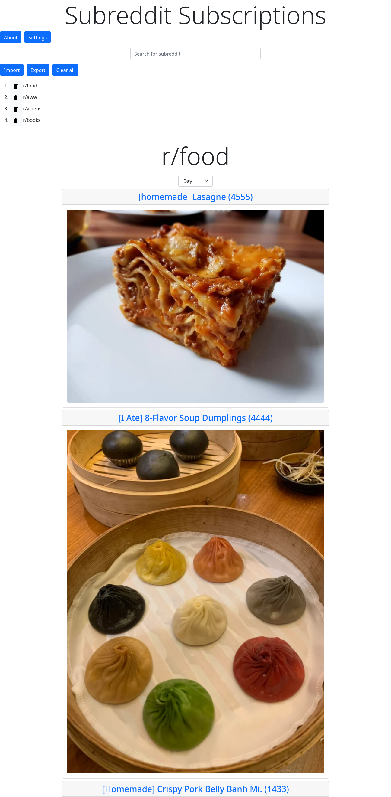

# subreddit-subscriptions-js
Subreddit Subscriptions using Node.js, Express, Angular, and MongoDB.

### [Check it out here](https://subreddit-subscriptions.vercel.app).

## What does it do?
Read the top posts of a list of subscribed subreddits, all in one place.

Simply search for a subreddit to add it to the list, or import an existing list from a JSON file.

## Why?
Do you have a lot of subreddits you want to keep up with daily?

For example, what if you are subscribed to /r/gamedeals and don't want to miss limited time offers?

Reddit allows you to subscribe to subreddits and view them on your home page.
However sorting by "top" sorts posts from all your subscriptions by the sheer number of upvotes.
This means larger subreddits with more users to vote on posts will always be at the top, while posts from smaller subreddits are stuck at the bottom.
This app allows you to customize which subreddits you want to see, and in what order.

It loads the top posts from each subreddit in the list, including images and media.
Clicking on a post's title or image opens a new tab showing that post on Reddit.
There are also keyboard shortcuts for faster navigation.

## Preview

